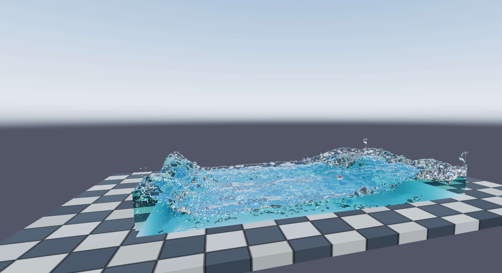
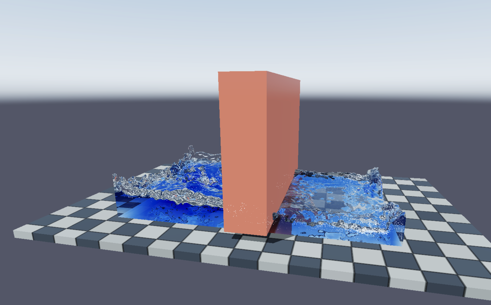
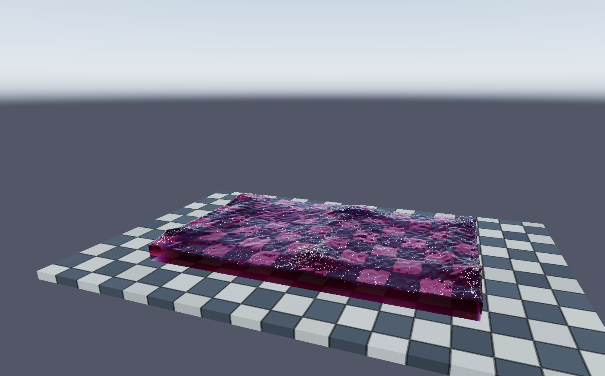
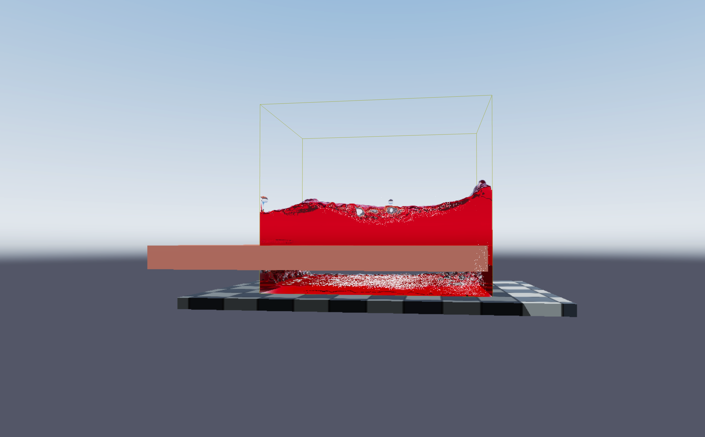

# Aqua

A real-time GPU fluid simulator built with Swift, SwiftUI, and Metal.

Aqua uses SPH (Smoothed Particle Hydrodamics) to simulate fluids through particles, and then with raymarching it reconstructs the surface of the fluid.

### Screenshots

